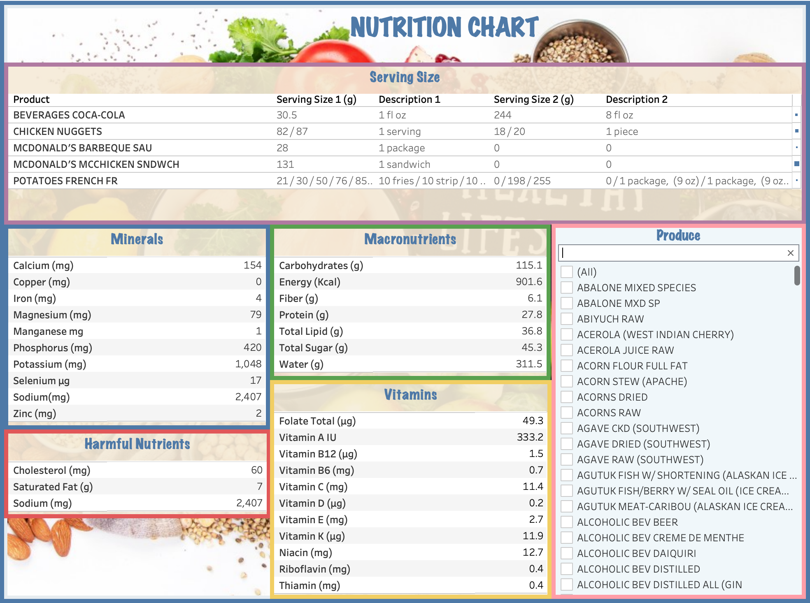

# Nutrition Dashboard for US Food Products

## Motivation

Ever wondered about that hangover after a heavy meal? Does your favorite meal supplement all your nutrition requirement? This interactive Tableau dashboard gives you the idea about your meal. Just select the food items you had and check the nutrients table!

## Procedure

1. Data Collection: The data was downloaded from [Kaggle: US Healthcare](https://www.kaggle.com/datasets/maheshdadhich/us-healthcare-data/data?select=Nutritions_US.csv) dataset.
   It was downloaded and extracted into Python Pandas notebook. The dataset, in csv format, was not utf-8 formatted, therefore had to be read with an encoding condition
   `encoding='ISO-8859-1`.
   
2. Data Condition: The dataset has 50 variables. They can be categorized as -

   - Short Description (Shrt_Desc): A short description of the food produce that ranged from single word to 12 words!
   - Nutrients: 45 different nutrients were listed for each of the food product
   - Serving size: Two distinct serving sizes along with their respective description

  The dataset was messy with hundreds of missing values, non-standard column names, lengthy and non-classifiable short descriptions about each food item, and the serving size descriptions of non-uniform formats.
   
3. Data Cleaning: The step was help in several steps in Python and MySQL interchangeably

  - Data Cleaning with Python -
    - Missing value treatment: The products with null values in certain nutrients were filled with 0 which is accurate with the situation
    - Standardizing column names: The column names had unaccepted special symbols and space which were removed and replaced with underscores and other alphanumerics using `RegEx`
    - Splitting the `Shrt_Desc` field: This field had description about each food product making it a unique column, however, unsuitable for any aggregate operations. These words were split into different columns resulting in 11 additional fields when split by commas. However, the first words did not give a product name but could be a brand name, therefore it had to be cleaned further
    - Creating a separate serving size description table: The produce names were surrounded by an unnecessary pair of double quotes which had to be removed to connect the dataset with the nutrients dataset for dashboard building

  - Data Cleaning with MySQL -
    - Produce names: The characteristics from the `Shrt_Desc` resulted in 12 additional fields. The relevant three first words were concatenated using `CONCAT_WS()` function and created the `Produce` field
    - Serving Size and descriptions: Once the dataset had food items that could be grouped based on the `Produce` field, the serving size and its description also had to be concatenated.
      
      For this, `GROUP_CONCAT(DISTINCT GmWt_1 ORDER BY GmWt_1 SEPARATOR ' / ') AS GmWt_1` function was used thus giving the details of all serving sizes without absurd aggregations
    - Multiple Tables creation by aggregation: With the `Produce` field to group the food items, the nutrients were averaged for each group. This reduced the redundacy in the dataset and grouped identical food produces together for easy finding

## [Dashboard](https://public.tableau.com/views/nutrition_chart/chart?:language=en-GB&:sid=&:redirect=auth&:display_count=n&:origin=viz_share_link)

With the clean dataset, the following dashboard was created on Tableau combining multiple tables and using Produce as the filter on all of the tables.

#### In the given snapshot, the total nutrients ingested with a McD Meal is given! Make your own meals and try the dashboard! 

#### Download the dashboard file and the dataset and explore your diet journey!! Don't forget to mention my repo!

## References 

Data Source: [Kaggle: US Healthcare Data](https://www.kaggle.com/datasets/maheshdadhich/us-healthcare-data/data?select=Nutritions_US.csv)

[Essential Nutrients for Human Body](https://www.britannica.com/science/human-nutrition/Essential-nutrients)
